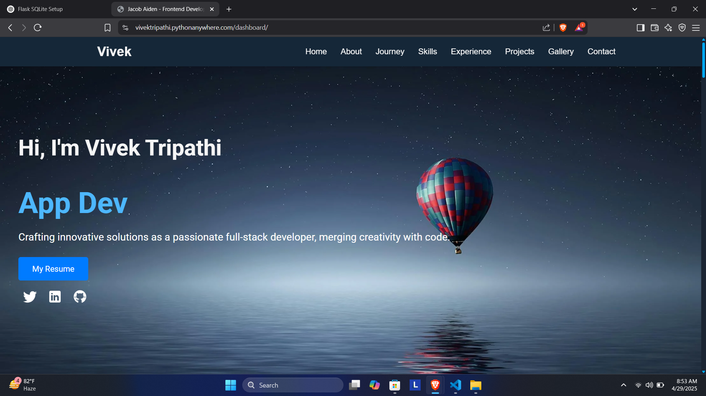
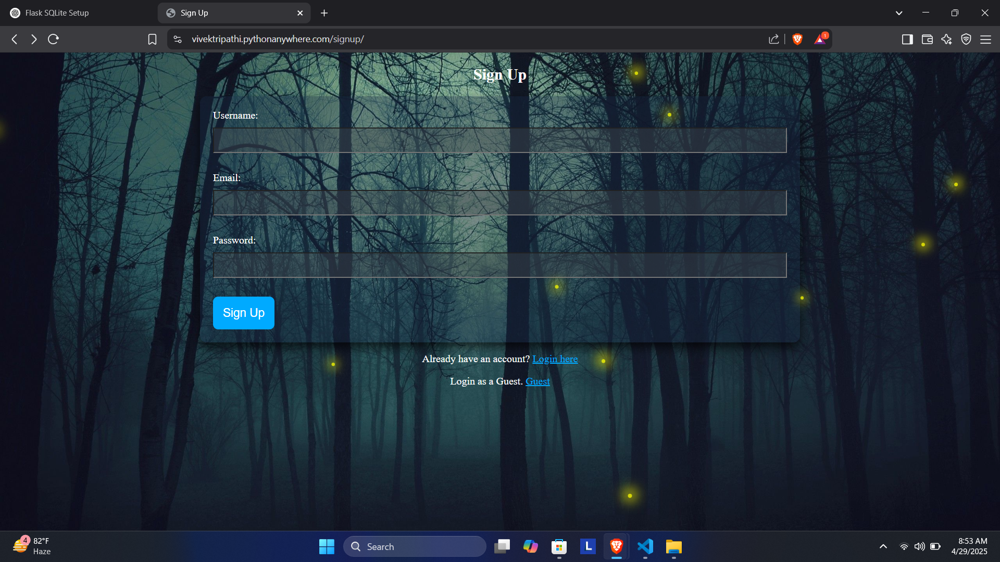
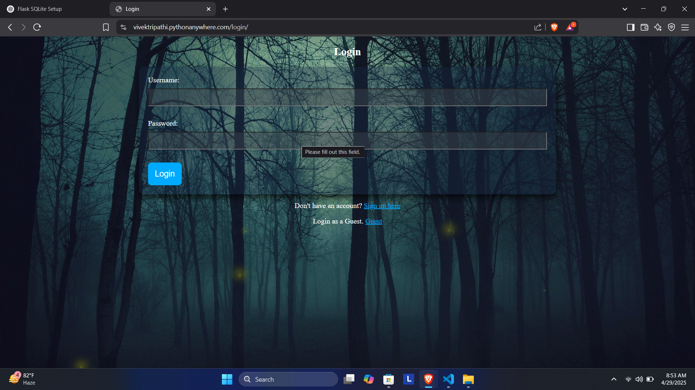

# Flask_Portfolio_Project
# 🚀 Flask 3D Animated Modern Portfolio - Signup Project

Welcome to my **3D Animated Professional Portfolio Website** built using **Flask**, **HTML5**, **CSS3**, **JavaScript**, and **Python**!  
This project features **beautiful 3D animations**, a **responsive design**, and secure **Login** / **Sign Up** pages.

✨ Created with Passion | 💻 Built with Modern Tech Stack

---

## 🛠️ Tech Stack Used

- **Frontend:**
  - HTML5
  - CSS3 (Animations, 3D Effects)
  - JavaScript

- **Backend:**
  - Python 3
  - Flask (Microframework)

- **Libraries & Packages:**
  - Flask
  - BeautifulSoup4
  - OpenCV
  - Pandas, NumPy, Scikit-Learn
  - Matplotlib, Seaborn
  - Other supportive packages (full list below)

---

## 📸 Project Snapshots

| Home Page | Signup Page | Login Page |
|:---------:|:-----------:|:----------:|
|  |  |  |

> (You can replace `img1.png`, `img2.png`, and `img3.png` with your actual images.)

---

## ✨ Features

- 🌐 **Modern Animated 3D Portfolio Design**
- 🔒 **User Authentication** (Sign Up and Login System)
- 🎨 **Fully Responsive** across devices
- ⚡ **Fast and Lightweight**
- 📜 **Clean and Modular Code**
- 🧠 **Python Backend** managing user data
- 📂 **Organized Project Structure** (Templates, Static files, Routes)

---

## 🚀 How To Run Locally

### 1. Clone the Repository
```bash
git clone https://github.com/Vivek-Tripathi00/Flask_Portfolio_Project.git
cd Flask_Portfolio_Project
